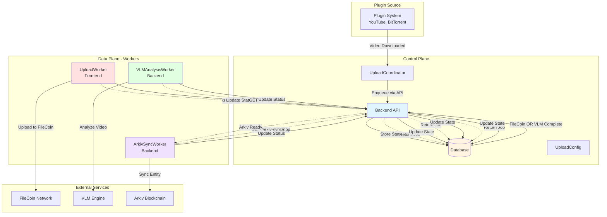
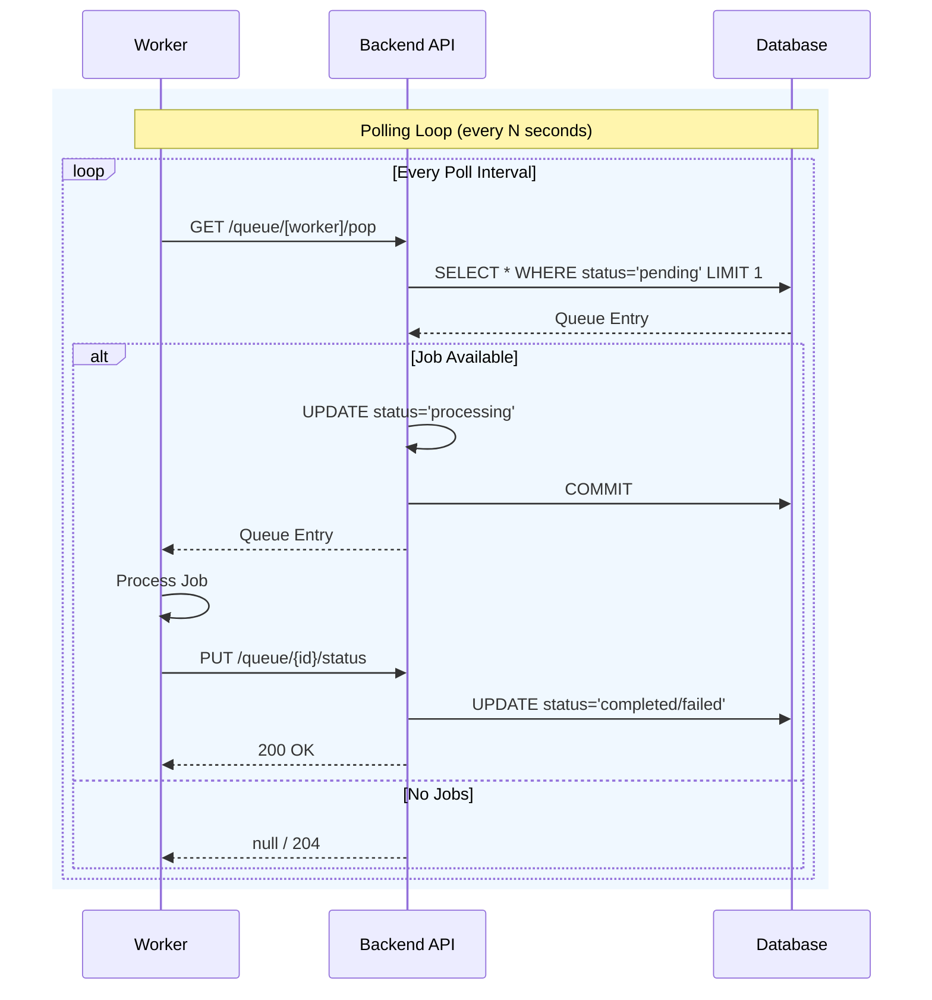
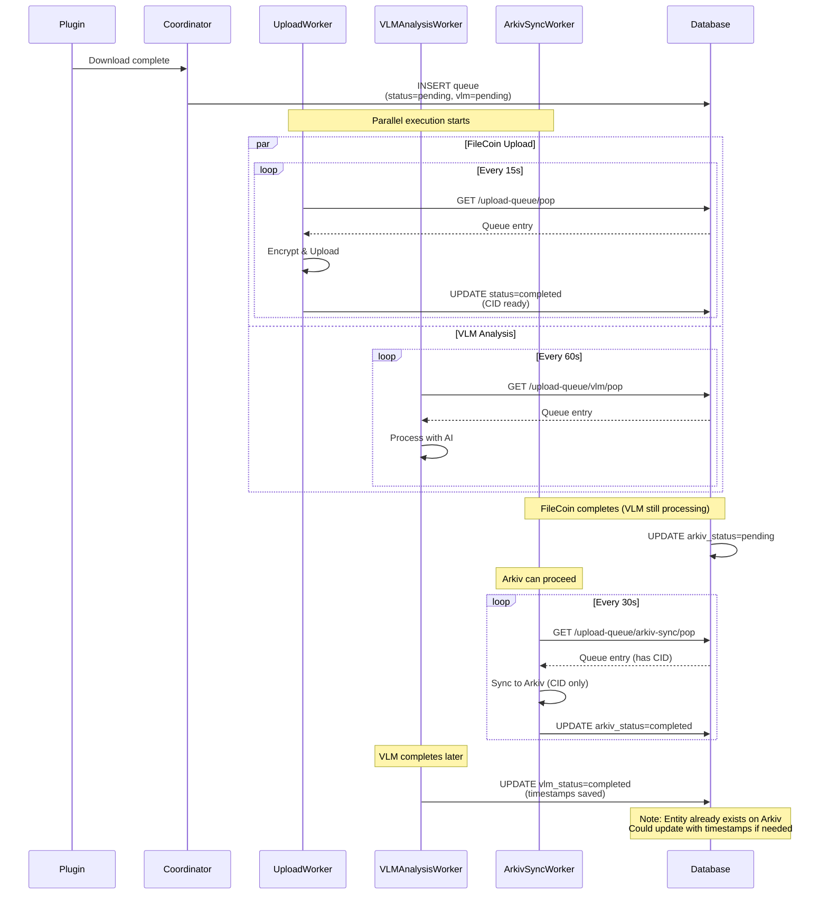
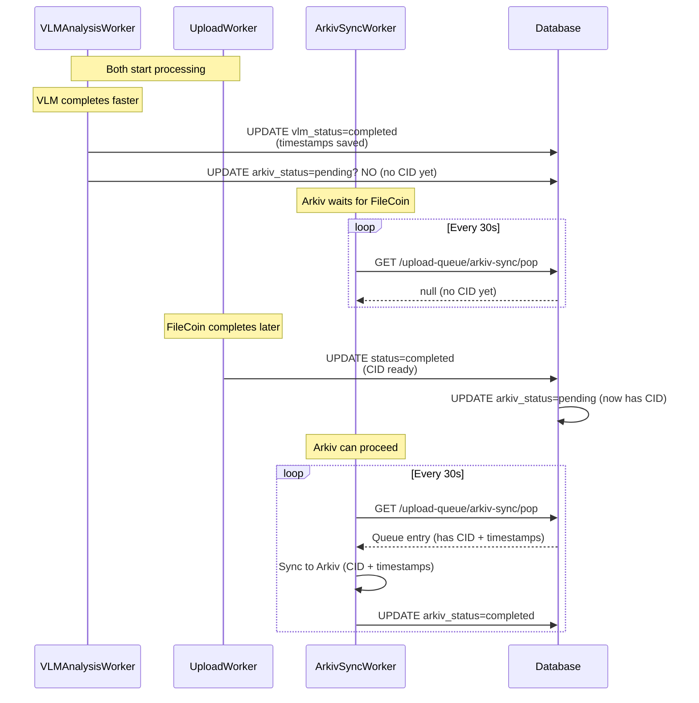
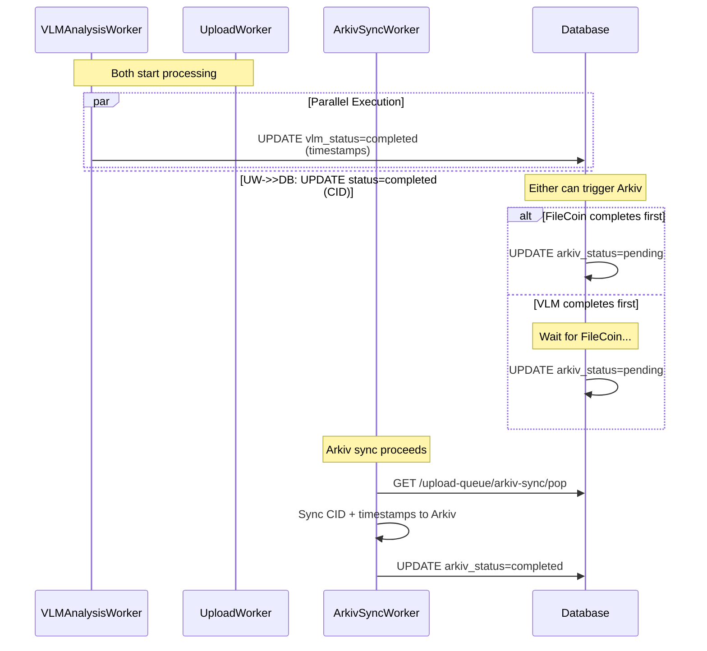
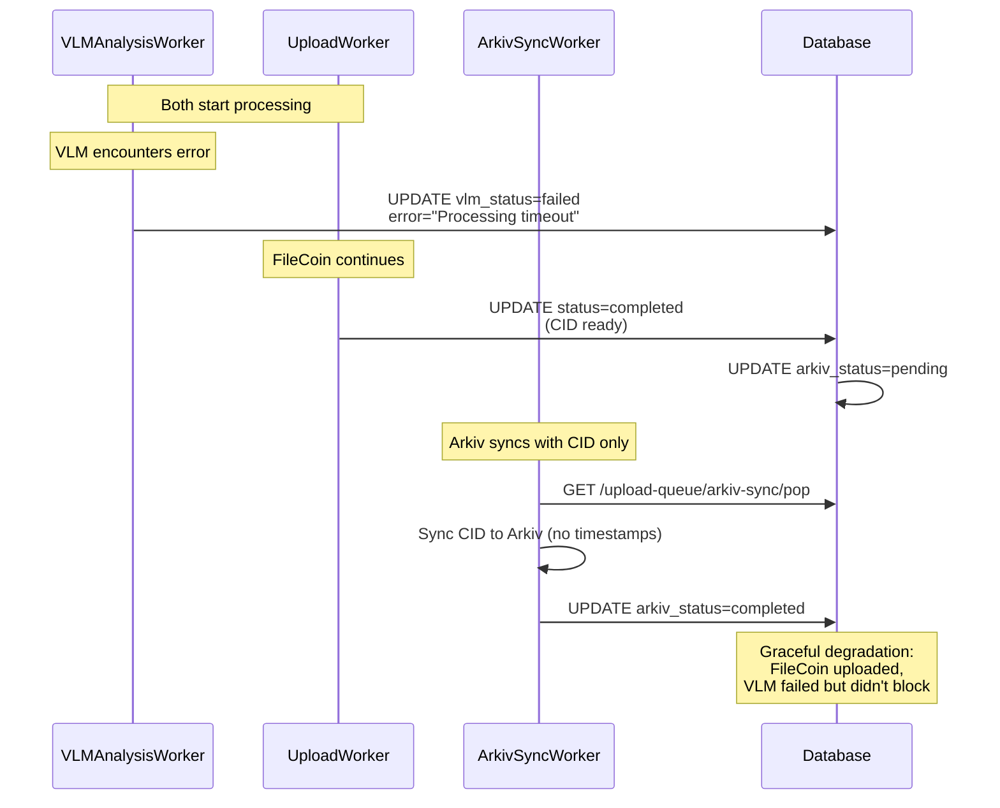
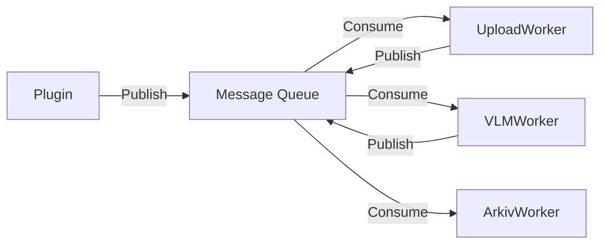
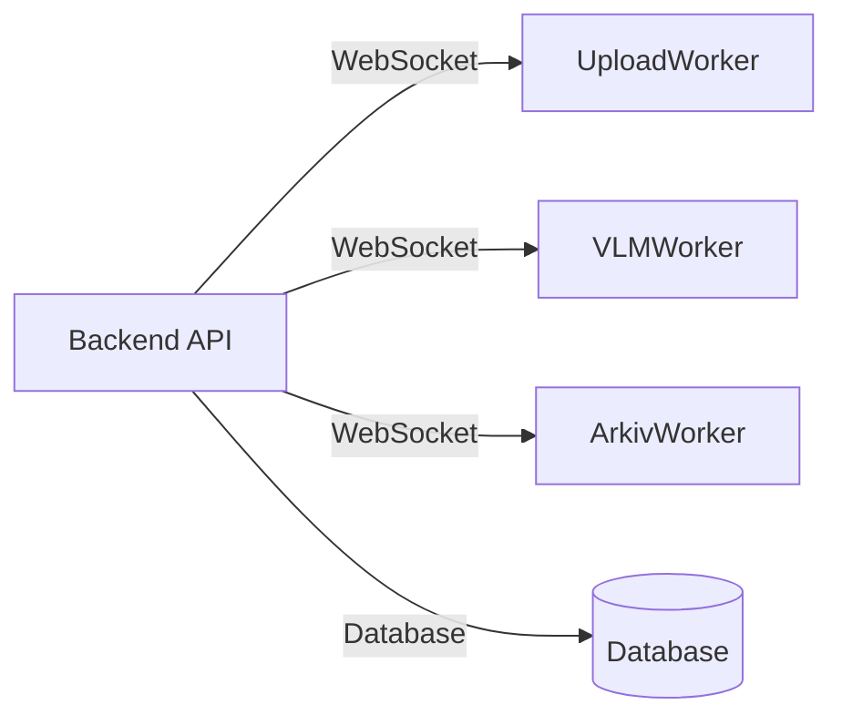

# Haven Player Parallel Upload Architecture

## Overview

Haven Player implements a **parallel upload architecture** that enables concurrent execution of FileCoin upload and VLM (Vision Language Model) analysis tasks. The system follows a **control/data plane paradigm** where workers communicate via the backend API through database state, enabling independent operation and graceful error handling.

## Architecture Components

### Control Plane

The **Control Plane** manages system state and coordinates operations through the backend API:

- **Backend API** (`upload_queue.py`): REST endpoints that manage database state
- **UploadQueue Model**: Tracks job status, timestamps, and error state
- **UploadCoordinator Service**: Determines when videos should be queued for upload
- **Video Model**: Stores per-video preferences (VLM enabled/disabled, Arkiv enabled)

The control plane is **stateless** - all state is persisted in the database.

### Data Plane

The **Data Plane** consists of independent workers that perform the actual work:

- **UploadWorker** (Frontend): Polls every 15s, uploads videos to FileCoin
- **VLMAnalysisWorker** (Backend): Polls every 60s, performs AI video analysis
- **ArkivSyncWorker** (Backend): Polls every 30s, syncs data to Arkiv blockchain

Workers **never coordinate directly** - they communicate only by reading/writing database state through API endpoints.

## System Diagram



## Worker Communication Pattern

 Workers follow a **poll-update** pattern:



## Key Design Principles

### 1. Independent Worker Execution

Each worker operates independently with its own polling interval:

| Worker | Poll Interval | Purpose | Dependencies |
|--------|--------------|---------|--------------|
| UploadWorker | 15s | Upload videos to FileCoin | None |
| VLMAnalysisWorker | 60s | Analyze videos with AI | None |
| ArkivSyncWorker | 30s | Sync data to Arkiv | FileCoin OR VLM completion |

Workers **never block** each other. If one worker fails, others continue running.

### 2. Independent Status Tracking

Each worker has its own status field in the `UploadQueue` table:

```python
# FileCoin upload status
status: str  # pending, processing, completed, failed, cancelled

# VLM analysis status
vlm_analysis_status: str  # pending, processing, completed, failed, skipped

# Arkiv sync status
arkiv_sync_status: str  # pending, syncing, completed, failed, skipped
```

Each status has its own timestamps:
- `started_at`: When processing began
- `completed_at`: When processing finished (completed/failed/skipped)

### 3. Parallel Execution with Partial Data

Arkiv sync can proceed with **partial data**:

```python
# Arkiv sync triggers when EITHER is true:
has_filecoin = bool(video.filecoin_root_cid)
has_timestamps = db.query(Timestamp).filter(...).count() > 0

if has_filecoin or has_timestamps:
    # Can sync with whatever data is available
    await perform_arkiv_sync()
```

This enables two parallel scenarios:

1. **FileCoin completes first**: Arkiv syncs with CID, VLM adds timestamps later
2. **VLM completes first**: Arkiv waits for FileCoin, then syncs with CID + timestamps

### 4. Graceful Degradation

The system degrades gracefully:

- **VLM fails**: FileCoin upload continues, Arkiv syncs with CID only
- **FileCoin fails**: VLM can still succeed (if desired), Arkiv won't sync
- **Both fail**: Pipeline stops, but workers continue processing other jobs

## Parallel Execution Flow

```mermaid
stateDiagram-v2
    [*] --> VideoDownloaded: Plugin downloads
    
    VideoDownloaded --> Queued: UploadCoordinator enqueues
    
    state Queued {
        [*] --> filecoin_pending
        filecoin_pending --> vlm_pending_or_skipped
        [*] --> vlm_pending_or_skipped
    }
    
    state filecoin_pending as FileCoin Upload {
        [*] --> pending
        pending --> processing: UploadWorker pops
        processing --> completed: Successful
        processing --> failed: Error
    }
    
    state vlm_pending_or_skipped as VLM Analysis {
        [*] --> vlm_pending
        [*] --> vlm_skipped: Disabled
        vlm_pending --> processing: VLMAnalysisWorker pops
        processing --> completed: Successful
        processing --> failed: Error
    }
    
    filecoin_pending.completed --> ArkivReady
    vlm_pending_or_skipped.completed --> ArkivReady
    vlm_pending_or_skipped.failed --> ArkivReady
    vlm_pending_or_skipped.skipped --> ArkivReady
    
    state ArkivReady as Arkiv Sync Ready {
        [*] --> arkiv_pending: FileCoin OR VLM complete
        arkiv_pending --> syncing: ArkivSyncWorker pops
        syncing --> completed: Success
        syncing --> failed: Error
        syncing --> skipped: Disabled/No data
    }
    
    ArkivReady --> [*]
```

## Data Flow Scenarios

### Scenario 1: FileCoin Completes First



### Scenario 2: VLM Completes First



### Scenario 3: Both Complete Successfully



### Scenario 4: VLM Fails, FileCoin Succeeds



## API Endpoints

### Upload Queue Management

#### POST /upload-queue
Add video to upload queue. Respects video's VLM preference.
- **Input**: `video_path`, `priority`, `source`
- **Output**: Queue entry with initial status

#### GET /upload-queue
List all queue entries (optional filtering).

#### GET /upload-queue/pop
Get next pending FileCoin upload job (UploadWorker).

#### GET /upload-queue/vlm/pop
Get next pending VLM analysis job (VLMAnalysisWorker).

#### GET /upload-queue/arkiv-sync/pop
Get next Arkiv sync job that's ready (has FileCoin OR VLM data).

#### PUT /upload-queue/{id}/status
Update FileCoin upload status. Can queue Arkiv sync on completion.

#### PUT /upload-queue/{id}/vlm-analysis
Update VLM analysis status. Can queue Arkiv sync if FileCoin exists.

#### PUT /upload-queue/{id}/arkiv-sync
Update Arkiv sync status. Updates video's `arkiv_entity_key` on success.

#### GET /upload-queue/stats
Get queue statistics (counts by status for all workers).

## Database Schema

### UploadQueue Table

```sql
CREATE TABLE upload_queue (
    id INTEGER PRIMARY KEY,
    video_path VARCHAR UNIQUE NOT NULL,
    status VARCHAR,                    -- FileCoin upload status
    priority INTEGER,
    created_at DATETIME,
    started_at DATETIME,                -- FileCoin start time
    completed_at DATETIME,              -- FileCoin completion time
    attempts INTEGER,
    max_attempts INTEGER,
    error_message TEXT,                 -- FileCoin error

    -- VLM analysis fields
    vlm_analysis_status VARCHAR,        -- VLM status (independent)
    vlm_analysis_started_at DATETIME,
    vlm_analysis_completed_at DATETIME,
    vlm_analysis_error TEXT,

    -- Arkiv sync fields
    arkiv_sync_status VARCHAR,          -- Arkiv status (independent)
    arkiv_sync_started_at DATETIME,
    arkiv_sync_completed_at DATETIME,
    arkiv_sync_error TEXT,

    source VARCHAR                      -- plugin, manual, depin
);
```

### Video Table (VLM Preferences)

```sql
CREATE TABLE videos (
    id INTEGER PRIMARY KEY,
    path VARCHAR UNIQUE NOT NULL,
    title VARCHAR NOT NULL,

    -- VLM preferences
    enable_vlm_analysis BOOLEAN DEFAULT FALSE,
    vlm_analysis_required BOOLEAN DEFAULT TRUE,

    -- Arkiv preference
    share_to_arkiv BOOLEAN DEFAULT TRUE,
    arkiv_entity_key VARCHAR,

    -- FileCoin metadata
    filecoin_root_cid VARCHAR,
    filecoin_piece_cid VARCHAR,
    filecoin_piece_id INTEGER,

    ... other fields ...
);
```

## Worker Startup & Shutdown

### Application Startup

```python
@asynccontextmanager
async def lifespan(app: FastAPI):
    # Initialize database
    init_db()

    # Load plugins
    plugin_manager = PluginManager(plugin_dirs)
    await plugin_manager.load_plugins(...)

    # Start workers (parallel execution)
    vlm_worker_task = asyncio.create_task(run_vlm_analysis_worker())
    arkiv_worker_task = asyncio.create_task(run_arkiv_sync_worker())

    yield  # Application running

    # Shutdown workers
    if vlm_worker_task and not vlm_worker_task.done():
        vlm_worker_task.cancel()
    if arkiv_worker_task and not arkiv_worker_task.done():
        arkiv_worker_task.cancel()
```

### Worker Tasks

Each worker runs independently as an asyncio task:

```python
async def run_vlm_analysis_worker(poll_interval=60):
    """Runs forever, polling for VLM jobs."""
    async with VLMAnalysisWorker() as worker:
        while True:
            processed = await worker.process_queue()
            await asyncio.sleep(poll_interval)

async def run_arkiv_sync_worker(poll_interval=30):
    """Runs forever, polling for Arkiv sync jobs."""
    async with ArkivSyncWorker() as worker:
        while True:
            processed = await worker.process_queue()
            await asyncio.sleep(poll_interval)
```

## Error Handling

### Worker-Level Errors

Workers handle errors gracefully:

```python
async def process_vlm_analysis_job(queue_id: int) -> bool:
    try:
        # Process video
        await process_video_for_queue(queue_id, video_path)
        await self.mark_vlm_analysis_completed(queue_id)
        return True
    except Exception as e:
        # Mark as failed, don't crash the worker
        await self.mark_vlm_analysis_failed(queue_id, str(e))
        return False
```

### Independent Failures

- **VLMAnalysisWorker fails**: UploadWorker continues, ArkivSyncWorker can still sync with FileCoin data
- **UploadWorker fails**: VLMAnalysisWorker continues, ArkivSyncWorker can sync with timestamp data (when FileCoin later completes)
- **ArkivSyncWorker fails**: VLM and UploadWorker continue, can retry Arkiv sync manually

## Monitoring & Observability

### Health Check Endpoint

```bash
GET /health

Response:
{
  "status": "healthy",
  "plugins": {...},
  "workers": [...],
  "arkiv_sync_worker": {"status": "running"},
  "vlm_analysis_worker": {"status": "running"}
}
```

### Queue Statistics

```bash
GET /upload-queue/stats

Response:
{
  "total": 100,
  "pending": 10,
  "processing": 5,
  "completed": 80,
  "failed": 3,
  "retryable": 2,

  "vlm_analysis_pending": 8,
  "vlm_analysis_processing": 3,
  "vlm_analysis_completed": 85,
  "vlm_analysis_failed": 2,
  "vlm_analysis_skipped": 2,

  "arkiv_sync_pending": 15,
  "arkiv_sync_syncing": 2,
  "arkiv_sync_completed": 80,
  "arkiv_sync_failed": 1,
  "arkiv_sync_skipped": 2
}
```

### Logging

All workers log to standard output with structured logs:

```
2026-01-10 12:00:00 - vlm_analysis_worker - INFO - 🚀 Starting VLM analysis worker
2026-01-10 12:00:15 - vlm_analysis_worker - INFO - Processing VLM analysis job 1: /test/video.mp4
2026-01-10 12:02:30 - vlm_analysis_worker - INFO - ✅ VLM analysis successful for /test/video.mp4
2026-01-10 12:02:30 - vlm_analysis_worker - INFO - Queued Arkiv sync for /test/video.mp4 after VLM analysis
```

## Scalability Considerations

### Horizontal Scaling

Workers can be scaled independently based on workload:

1. **UploadWorker**: Scale up for heavy upload throughput
2. **VLMAnalysisWorker**: Scale up for AI analysis-intensive workloads
3. **ArkivSyncWorker**: Scale up for blockchain transaction volume

### Resource Isolation

```python
# Workers use different resources:
# - UploadWorker: CPU for encryption, Network for upload
# - VLMAnalysisWorker: GPU/CPU for AI model, Network for model loading
# - ArkivSyncWorker: Network for blockchain RPC, CPU for signing
```

### Polling Intervals

Adjust based on workload and API costs:

| Operation | Current Interval | High Throughput | Low Latency |
|-----------|------------------|-----------------|-------------|
| FileCoin Pop | 15s | 5-10s | 30s |
| VLM Pop | 60s | 30s | 120s |
| Arkiv Sync Pop | 30s | 10-15s | 60s |

## Security Considerations

### Worker Authentication

Workers communicate via localhost API (no external access needed):

```python
# Workers use internal API
API_BASE_URL = "http://localhost:8000"

# No authentication required for workers
# They run as trusted backend processes
```

### Data Encryption

- **FileCoin Upload**: Encrypted by UploadWorker before upload
- **VLM Analysis**: Processes local video files (no transmission)
- **Arkiv Sync**: Transmits encrypted metadata to blockchain

### Access Control

Per-video preferences control data flow:

```python
# Video can opt-out of each step:
video.enable_vlm_analysis = False      # Skip AI analysis
video.share_to_arkiv = False           # Skip blockchain sync
```

## Future Enhancements

### Potential Improvements

1. **Event-Driven Architecture**: Replace polling with database triggers or message queue
2. **Worker Priority Levels**: Add job priority support for each worker type
3. **Retry Policies**: Implement exponential backoff for failed jobs
4. **Metrics Dashboard**: Real-time monitoring of worker throughput and latency
5. **Distributed Worker Deployment**: Run workers on separate machines for scale

### Alternative Architectures

**Message Queue Approach** (Scalable but more complex):



**WebSocket Approach** (Lower latency but higher complexity):



## Conclusion

The Haven Player parallel upload architecture provides:

✅ **Scalability**: Workers scale independently based on workload
✅ **Resilience**: Worker failures don't cascade to other workers
✅ **Flexibility**: Per-video preferences enable optional features
✅ **Simplicity**: Clear separation of control/data plane
✅ **Observability**: Comprehensive logging and status tracking

The system efficiently handles concurrent FileCoin upload and VLM analysis while maintaining data integrity and graceful error handling.
