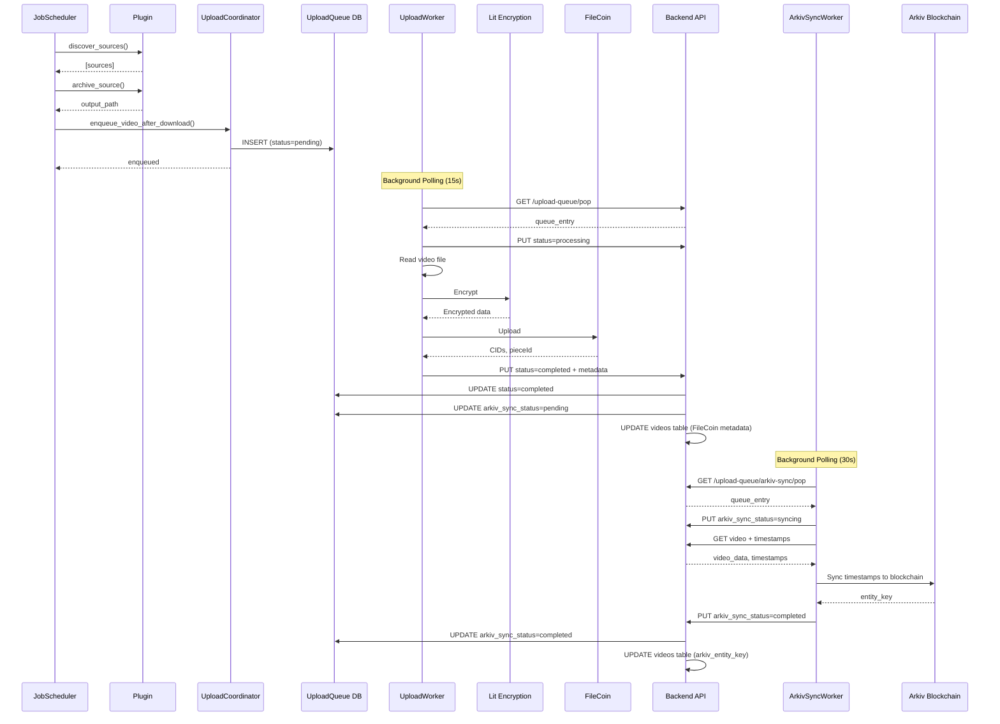

# Upload Coordinator Documentation

## Overview

The Upload Coordinator is a system that bridges the gap between backend plugin downloads and frontend FileCoin uploads. It enables automatic uploads of videos downloaded by plugins without requiring manual user intervention.

## Architecture

### Components

1. **UploadQueue Database Model** (`backend/app/models/upload_queue.py`)
   - Tracks videos waiting to be uploaded
   - Manages upload state (pending, processing, completed, failed, cancelled)
   - Stores retry attempts and error information
   - Tracks upload source (plugin, manual, depin)

2. **UploadCoordinator Service** (`backend/app/services/upload_coordinator.py`)
   - Coordinates automatic FileCoin uploads
   - Checks configuration before queuing uploads
   - Provides API for plugin integration
   - Manages per-plugin settings

3. **UploadWorker** (`frontend/src/services/uploadWorker.ts`)
   - Background worker in Electron main process
   - Polls upload queue and processes uploads
   - Uses existing FileCoin upload logic
   - Runs independently of UI (works when minimised)

4. **Upload Queue API** (`backend/app/api/upload_queue.py`)
   - REST endpoints for queue management
   - Queue operations: add, list, pop, update, delete
   - Status monitoring and statistics
   - Arkiv sync queue management

5. **ArkivSyncWorker** (`backend/app/services/arkiv_sync_worker.py`)
   - Background worker that processes Arkiv sync queue
   - Automatically syncs timestamps to blockchain after FileCoin upload
   - Runs as async task in backend process
   - Handles failed sync tracking and retry logic

## Data Flow



## Configuration

### Backend Configuration

The UploadCoordinator service checks the following environment variables:

- `FILECOIN_PRIVATE_KEY`: Private key for FileCoin operations (required)
- `FILECOIN_RPC_URL`: RPC URL for FileCoin blockchain (required)

### Frontend Configuration

The UploadWorker can be configured via the following settings:

```typescript
interface UploadCoordinatorConfig {
  enabled: boolean;              // Enable/disable auto-upload
  pollInterval: number;          // Polling interval in milliseconds
  maxConcurrentUploads: number;  // Max concurrent uploads (future)
  retryAttempts: number;         // Max retry attempts per video
  pluginOverrides: Record<string, boolean>;  // Per-plugin overrides
}
```

Default configuration:
- `enabled`: `false` (auto-upload disabled by default)
- `pollInterval`: `15000` (15 seconds)
- `maxConcurrentUploads`: `1`
- `retryAttempts`: `3`

## API Endpoints

### Upload Queue API

Base URL: `http://localhost:8000/api`

#### POST `/upload-queue`
Add a video to the upload queue.

**Request:**
```json
{
  "video_path": "/path/to/video.mp4",
  "priority": 0,
  "source": "plugin"
}
```

**Response (201):**
```json
{
  "id": 1,
  "video_path": "/path/to/video.mp4",
  "status": "pending",
  "priority": 0,
  "created_at": "2024-01-09T12:00:00Z",
  "source": "plugin",
  "attempts": 0,
  "max_attempts": 3
}
```

#### GET `/upload-queue`
List videos in the upload queue.

**Query Parameters:**
- `status` (optional): Filter by status (`pending`, `processing`, `completed`, `failed`, `cancelled`)
- `source` (optional): Filter by source (`plugin`, `manual`, `depin`)
- `limit` (optional): Maximum number of results (default: 100)

**Response (200):**
```json
[
  {
    "id": 1,
    "video_path": "/path/to/video.mp4",
    "status": "pending",
    "priority": 0,
    "created_at": "2024-01-09T12:00:00Z",
    "source": "plugin"
  }
]
```

#### GET `/upload-queue/pop`
Get next pending video for upload (for UploadWorker).

**Response (200):**
```json
{
  "id": 1,
  "video_path": "/path/to/video.mp4",
  "status": "processing",
  "priority": 0,
  "created_at": "2024-01-09T12:00:00Z",
  "started_at": "2024-01-09T12:01:00Z",
  "attempts": 1,
  "source": "plugin"
}
```

**Response (204):** No pending uploads

#### PUT `/upload-queue/{id}/status`
Update upload status.

**Request:**
```json
{
  "status": "completed",
  "filecoin_metadata": {
    "root_cid": "bafy...",
    "piece_cid": "baga...",
    "piece_id": 123,
    "data_set_id": "dataset-001",
    "transaction_hash": "0x..."
  },
  "error": null
}
```

**Response (200):** Updated queue entry

#### DELETE `/upload-queue/{id}`
Remove video from upload queue.

**Response (204):** No content

#### GET `/upload-queue/stats`
Get upload queue statistics.

**Response (200):**
```json
{
  "total": 10,
  "pending": 3,
  "processing": 1,
  "completed": 5,
  "failed": 1,
  "cancelled": 0,
  "retryable": 1,
  "arkiv_sync_pending": 3,
  "arkiv_sync_syncing": 1,
  "arkiv_sync_completed": 5,
  "arkiv_sync_failed": 1,
  "arkiv_sync_skipped": 0
}
```

#### GET `/upload-queue/arkiv-sync/pop`
Get next pending video for Arkiv sync (for ArkivSyncWorker).

**Response (200):**
```json
{
  "id": 1,
  "video_path": "/path/to/video.mp4",
  "status": "completed",
  "arkiv_sync_status": "syncing",
  "arkiv_sync_started_at": "2024-01-09T12:05:00Z",
  "priority": 0,
  "created_at": "2024-01-09T12:00:00Z"
}
```

**Response (204):** No pending Arkiv sync jobs

#### PUT `/upload-queue/{id}/arkiv-sync`
Update Arkiv sync status.

**Request:**
```json
{
  "arkiv_sync_status": "completed",
  "entity_key": "arkiv-key-123",
  "arkiv_sync_error": null
}
```

**Response (200):** Updated queue entry

**Status Values:**
- `pending`: Waiting for Arkiv sync
- `syncing`: Arkiv sync in progress
- `completed`: Arkiv sync successful
- `failed`: Arkiv sync failed
- `skipped`: Arkiv sync was skipped (no timestamps or disabled)

### Arkiv Sync Architecture

The upload system now supports automatic Arkiv synchronization through a two-stage process:

1. **Stage 1: FileCoin Upload** (UploadWorker - browser-based)
   - Uploads encrypted video to FileCoin storage layer
   - Updates `upload_queue` status to `completed`
   - Backend automatically queues Arkiv sync if video needs it

2. **Stage 2: Arkiv Sync** (ArkivSyncWorker - backend-based)
   - Syncs video timestamps to Arkiv blockchain
   - Runs every 30 seconds as background task
   - Updates `upload_queue.arkiv_sync_status` through its lifecycle

**Automatic Arkiv Sync Triggers:**

Arkiv sync is automatically queued when ALL conditions are met:
- `upload_queue.status = 'completed'` (FileCoin upload succeeded)
- `video.share_to_arkiv = TRUE` (video flagged for Arkiv)
- `video.arkiv_entity_key = NULL` (not yet synced)
- Timestamp entries exist for the video (required for Arkiv)

**Arkiv Sync State Machine:**

```
pending → syncing → completed (success)
pending → syncing → failed (error with retry potential)
pending → skipped (no timestamps or share_to_arkiv=false)
```

## Integration with JobScheduler

The UploadCoordinator is automatically integrated with the JobScheduler. When a plugin downloads a video (via `archive_source`), the video is automatically queued for upload if:

1. Auto-upload is enabled for the plugin
2. FileCoin is configured (private key and RPC URL)
3. The video hasn't already been uploaded

### Example Job Configuration

```python
await scheduler.create_job(
    plugin_name="YouTubePlugin",
    job_name="poll_youtube_channel",
    schedule="0 * * * *",  # Every hour
    method="discover_sources",
    on_success="archive_all",  # Archive and auto-upload
)
```

## Frontend Integration

### Starting the Upload Worker

```typescript
import { uploadWorkerService } from '@/services/uploadWorkerService';

// Start with default configuration
const response = await uploadWorkerService.start();

if (response.filecoinConfigured) {
  console.log('Upload worker started with auto-upload enabled');
}

// Start with custom configuration
await uploadWorkerService.start({
  enabled: true,
  pollInterval: 10000,
  retryAttempts: 5,
});
```

### Getting Worker Status

```typescript
const status = await uploadWorkerService.getStatus();
console.log('Worker running:', status.isRunning);
console.log('Config:', status.config);
```

### Getting Queue Statistics

```typescript
const stats = await uploadWorkerService.getQueueStats();
console.log('Pending uploads:', stats.pending);
console.log('Completed uploads:', stats.completed);
```

### Using the React Hook

```typescript
import { useUploadWorker } from '@/hooks/useUploadWorker';

function MyComponent() {
  const {
    status,
    queueStats,
    loading,
    error,
    start,
    stop,
    refreshStatus,
  } = useUploadWorker();

  if (loading) return <div>Loading...</div>;

  return (
    <div>
      <div>Worker Running: {status?.isRunning ? 'Yes' : 'No'}</div>
      <div>Pending: {queueStats?.pending}</div>
      <div>Completed: {queueStats?.completed}</div>
      <button onClick={() => start({ enabled: true })}>
        Start Worker
      </button>
      <button onClick={stop}>Stop Worker</button>
    </div>
  );
}
```

## Benefits

- **Control/Data Plane Separation:** UploadWorker (data plane) handles FileCoin uploads in browser, ArkivSyncWorker (control plane) handles blockchain sync in backend
- **Database-Driven State:** All state tracked in database, no API coordination needed between workers
- **Independent Retry Logic:** FileCoin and Arkiv sync have separate retry queues and failure handling
- **Observable:** Complete visibility into both upload stages via database queries and API statistics
- **Configurable:** Video-level `share_to_arkiv` flag respects user preferences
- **Centralized Logging:** All operations logged in backend with consistent format
- **Non-Blocking:** FileCoin uploads continue even if Arkiv sync is delayed or fails

## Troubleshooting

### Upload Worker Not Starting

**Symptom:** Upload worker fails to start or shows "Filecoin not configured"

**Solution:**
1. Check that FileCoin is configured in settings
2. Verify `FILECOIN_PRIVATE_KEY` and `FILECOIN_RPC_URL` environment variables are set
3. Restart the Haven Player application

### Videos Not Being Auto-Uploaded

**Symptom:** Plugin downloads videos but they remain pending

**Solution:**
1. Check that auto-upload is enabled for the plugin
2. Verify FileCoin configuration
3. Check upload worker status in DePin Dashboard
4. Review backend logs for errors

### Upload Failures

**Symptom:** Uploads fail with error messages

**Solution:**
1. Upload worker automatically retries up to 3 times
2. Check FileCoin wallet balance (gas required)
3. Verify RPC URL is correct and accessible
4. Check network connection
5. Review error messages in upload queue logs

### High Queue Backlog

**Symptom:** Many pending uploads accumulating

**Solution:**
1. Check if upload worker is running
2. Review upload failure rate
3. Check network bandwidth
4. Consider increasing poll interval if needed
5. Check FileCoin network status

### Arkiv Sync Failures

**Symptom:** Videos uploaded successfully but Arkiv sync fails

**Solution:**
1. Check backend logs for Arkiv sync errors
2. Verify Arkiv network connectivity
3. Check if blockchain has sufficient gas
4. Review Arkiv configuration in backend
5. Check that timestamps exist for the video
6. Verify `share_to_arkiv` flag is set correctly on video

## Performance Considerations

- **Polling Overhead:** Default 15-second polling interval balances responsiveness and overhead
- **Concurrency:** Currently limited to 1 concurrent upload to avoid overwhelming FileCoin
- **Retry Logic:** Failed uploads are retried up to 3 times with exponential backoff
- **Queue Size:** Monitor queue size to prevent unbounded growth

## Security Considerations

- Private keys are stored in Electron secure storage (safeStorage)
- All FileCoin operations use encrypted credentials
- Upload queue is internal API (not exposed externally)
- Video paths are validated before processing

## Future Enhancements

- [ ] Support for multiple concurrent uploads
- [ ] Priority-based upload scheduling
- [ ] Integration with DePinDashboard upload queue
- [ ] Upload bandwidth limiting
- [ ] Support for batch operations
- [ ] Webhook notifications for upload events
- [ ] Upload queue persistence across restarts

## Testing

Run unit tests:

```bash
# Backend tests
cd backend
pytest app/models/__tests__/test_upload_queue.py -v

# Frontend tests (if added)
cd frontend
npm test src/hooks/__tests__/useUploadWorker.test.ts
```

## References

- [FileCoin Upload Documentation](./filecoin_upload.md)
- [Lit Protocol Integration](./lit_protocol_integration.md)
- [Plugin System Documentation](./plugin_system.md)
- [JobScheduler Documentation](./job_scheduler.md)
